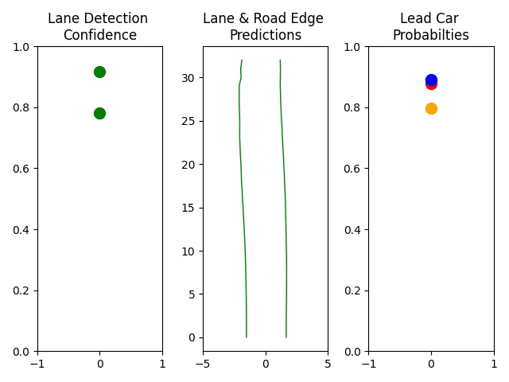

# Extended results from the paper

|                                            | Falsification Rate | Avg. Total  Time (s) | Avg. Falsification  Time (s) | Average  Restarts | Images with Counterexamples |
|--------------------------------------------|:------------------:|:--------------------:|:----------------------------:|:-----------------:|:---------------------------:|
| Property 1: nearest lanes confidence       |                17% |                222.6 |                        142.8 |              88.2 |                           4 |
| Property 2: last y-values of nearest lanes |                47% |                123.6 |                         44.6 |              60.3 |                           6 |
| Property 3: lead car confidence            |                58% |                197.4 |                         46.5 |              46.5 |                           6 |

The above results show average falsification performance for ten images within _epsilon_=10.
The distance metric determining epsilon was computed using _L-infinity_, meaning that the distance was calculated according to the maximum difference of any value in the generated input from the original input. 

## Original Input Images

Original images were chosen for the variety of the environment shown in the input imageset and the interpretability and stability of the network output.

### Imageset 005

Image 0            |  Image 1
:-------------------------:|:-------------------------:
 |  

Output          | 
:-------------------------:|
 |

### Imageset 102

Image 0            |  Image 1
:-------------------------:|:-------------------------:
 |  

Output          | 
:-------------------------:|
 |

### Imageset 104

Image 0            |  Image 1
:-------------------------:|:-------------------------:
 |  

Output          | 
:-------------------------:|
 |

### Imageset 199

Image 0            |  Image 1
:-------------------------:|:-------------------------:
 |  

Output          | 
:-------------------------:|
 |

### Imageset 314

Image 0            |  Image 1
:-------------------------:|:-------------------------:
 |  

Output          | 
:-------------------------:|
 |

### Imageset 390

Image 0            |  Image 1
:-------------------------:|:-------------------------:
 |  

Output          | 
:-------------------------:|
 |

### Imageset 448

Image 0            |  Image 1
:-------------------------:|:-------------------------:
 |  

Output          | 
:-------------------------:|
 |

### Imageset 475

Image 0            |  Image 1
:-------------------------:|:-------------------------:
 |  

Output          | 
:-------------------------:|
 |

### Imageset 597

Image 0            |  Image 1
:-------------------------:|:-------------------------:
 |  

Output          | 
:-------------------------:|
 |

### Imageset 680

Image 0            |  Image 1
:-------------------------:|:-------------------------:
 |  

Output          | 
:-------------------------:|
 |

## Baseline Input Images

### Imageset 005

Image 0            |  Image 1
:-------------------------:|:-------------------------:
 |  

Output          | 
:-------------------------:|
 |

### Imageset 102

Image 0            |  Image 1
:-------------------------:|:-------------------------:
 |  

Output          | 
:-------------------------:|
 |

### Imageset 104

Image 0            |  Image 1
:-------------------------:|:-------------------------:
 |  

Output          | 
:-------------------------:|
 |

### Imageset 199

Image 0            |  Image 1
:-------------------------:|:-------------------------:
 |  

Output          | 
:-------------------------:|
 |

### Imageset 314

Image 0            |  Image 1
:-------------------------:|:-------------------------:
 |  

Output          | 
:-------------------------:|
 |

### Imageset 390

Image 0            |  Image 1
:-------------------------:|:-------------------------:
 |  

Output          | 
:-------------------------:|
 |

### Imageset 448

Image 0            |  Image 1
:-------------------------:|:-------------------------:
 |  

Output          | 
:-------------------------:|
 |

### Imageset 475

Image 0            |  Image 1
:-------------------------:|:-------------------------:
 |  

Output          | 
:-------------------------:|
 |

### Imageset 597
Image 0            |  Image 1
:-------------------------:|:-------------------------:
 |  

Output          | 
:-------------------------:|
 |

### Imageset 680

Image 0            |  Image 1
:-------------------------:|:-------------------------:
 |  

Output          | 
:-------------------------:|
 |

## Counterexamples for Property 1

original imageset, original output, counterexample pair, counterexample output 

## Counterexamples for Property 2

## Counterexamples for Property 3

