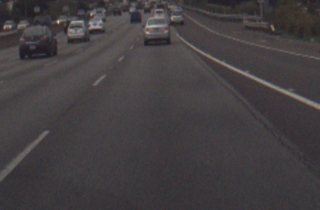

# Extended results from the paper

|                                            | Falsification Rate | Avg. Total  Time (s) | Avg. Falsification  Time (s) | Average  Restarts | Images with Counterexamples |
|--------------------------------------------|:------------------:|:--------------------:|:----------------------------:|:-----------------:|:---------------------------:|
| Property 1: nearest lanes confidence       |                17% |                222.6 |                        142.8 |              88.2 |                           4 |
| Property 2: last y-values of nearest lanes |                47% |                123.6 |                         44.6 |              60.3 |                           6 |
| Property 3: lead car confidence            |                58% |                197.4 |                         46.5 |              46.5 |                           6 |

The above results show average falsification performance for ten images within _epsilon_=10.
The distance metric determining epsilon was computed using _L-infinity_, meaning that the distance was calculated according to the maximum difference of any value in the generated input from the original input. 

## Original Input Images

Original images were chosen for the variety of the environment shown in the input imageset and the interpretability and stability of the network output.
Each imageset is comprised of two consecutive images, Image 0 and Image 1, collected by an onboard camera during "normal" driving on highway and surface roads. 
These two images are reordered into a composite tensor to be fed to the supercombo network as one input.
The original imagesets are shown with their corresponding output from the network.
The other 3 inputs were given default values. Refer to [property definitions](falsification/properties) for default values.
To download this dataset for yourself, refer to the [dataset README](dataset/README.md).

### Imageset 005

Image 0            |  Image 1        | Output
:-------------------------:|:-------------------------:|:-------------------------:
 |   |  

### Imageset 102

Image 0            |  Image 1      | Output
:-------------------------:|:-------------------------:|:-------------------------:
 |   |  

### Imageset 104

Image 0            |  Image 1     | Output
:-------------------------:|:-------------------------:|:-------------------------:
 |   |  

### Imageset 199

Image 0            |  Image 1     | Output
:-------------------------:|:-------------------------:|:-------------------------:
 |   |  

### Imageset 314

Image 0            |  Image 1     | Output
:-------------------------:|:-------------------------:|:-------------------------:
 |    | 

### Imageset 390

Image 0            |  Image 1          | Output
:-------------------------:|:-------------------------:|:-------------------------:
 |     | 

### Imageset 448

Image 0            |  Image 1          | Output
:-------------------------:|:-------------------------:|:-------------------------:
 |    | 

### Imageset 475

Image 0            |  Image 1          | Output
:-------------------------:|:-------------------------:|:-------------------------:
 |    | 

### Imageset 597

Image 0            |  Image 1          | Output
:-------------------------:|:-------------------------:|:-------------------------:
 |    | 

### Imageset 680

Image 0            |  Image 1          | Output
:-------------------------:|:-------------------------:|:-------------------------:
 |   | 

## Baseline Input Images

The baseline images were generated by sampling noise from a Gaussian distribution and applying them to the original input images.
Baseline images with an L-infinity distance of 10 from the original images were included in this study.
Just like the original images, the baseline Image 0 and Image 1 are preprocessed into a single composite tensor before being passed to the network.
The purpose of the baseline is to determine the susceptibility of the network to untargeted changes in the image inputs.
As displayed in the baseline images below, the change in output compared to the original image inputs is minimal.
The changes in output do not violate the limits given in the [property definitions](falsification/properties).

### Imageset 005

Image 0            |  Image 1          | Output
:-------------------------:|:-------------------------:|:-------------------------:
 |    |  

### Imageset 102

Image 0            |  Image 1          | Output
:-------------------------:|:-------------------------:|:-------------------------:
 |    | 

### Imageset 104

Image 0            |  Image 1          | Output
:-------------------------:|:-------------------------:|:-------------------------:
 |   | 

### Imageset 199

Image 0            |  Image 1          | Output
:-------------------------:|:-------------------------:|:-------------------------:
 |    | 

### Imageset 314

Image 0            |  Image 1          | Output
:-------------------------:|:-------------------------:|:-------------------------:
 |   | 

### Imageset 390

Image 0            |  Image 1          | Output
:-------------------------:|:-------------------------:|:-------------------------:
 |   | 

### Imageset 448

Image 0            |  Image 1          | Output
:-------------------------:|:-------------------------:|:-------------------------:
 |   |  

### Imageset 475

Image 0            |  Image 1          | Output
:-------------------------:|:-------------------------:|:-------------------------:
 |   | 

### Imageset 597
Image 0            |  Image 1          | Output
:-------------------------:|:-------------------------:|:-------------------------:
 |   |  

### Imageset 680

Image 0            |  Image 1          | Output
:-------------------------:|:-------------------------:|:-------------------------:
 |   |  

## Counterexamples for Property 1

|                | Imageset 005                             | Imageset 102 | Imageset 104 | Imageset 199 | Imageset 314 |
|----------------|------------------------------------------|--------------|--------------|--------------|--------------|
| Original Image 0 |  |  |  |   |  
| Counterexample Image 0 |  |  |  | N/A          | N/A          |
| Output         |  |  |  | N/A          | N/A          |

|                | Imageset 390 | Imageset 448 | Imageset 475                                                                                      | Imageset 597                                                                                      | Imageset 680 |
|----------------|--------------|--------------|---------------------------------------------------------------------------------------------------|---------------------------------------------------------------------------------------------------|--------------|
| Original Image 0 |  |  |  |   |  
| Counterexample Image 0 | N/A | N/A |    |    | N/A |
| Output         | N/A | N/A |  |  | N/A |

## Counterexamples for Property 2

|                | Imageset 005 | Imageset 102 | Imageset 104                                                                                       | Imageset 199                                                                                       | Imageset 314 |
|----------------|--------------|--------------|----------------------------------------------------------------------------------------------------|----------------------------------------------------------------------------------------------------|--------------|
| Original Image 0 |  |  |  |   |  
| Counterexample Image 0 | N/A          |  |    |    | N/A |
| Output         | N/A          |  |  |  | N/A |

|                | Imageset 390                             | Imageset 448                                                                                       | Imageset 475                                                                                      | Imageset 597 | Imageset 680                                                                                      |
|----------------|------------------------------------------|----------------------------------------------------------------------------------------------------|---------------------------------------------------------------------------------------------------|--------------|---------------------------------------------------------------------------------------------------|
| Original Image 0 |  |  |  |   |  
| Counterexample Image 0 | N/A                                      |    |    | N/A |    |
| Output         | N/A |  |  | N/A |  |

## Counterexamples for Property 3

|                | Imageset 005                             | Imageset 102                                                                                        | Imageset 104                                                                                       | Imageset 199                                                                                       | Imageset 314                                                                                       |
|----------------|------------------------------------------|-----------------------------------------------------------------------------------------------------|----------------------------------------------------------------------------------------------------|----------------------------------------------------------------------------------------------------|----------------------------------------------------------------------------------------------------|
| Original Image 0 |  |  |  |   |  
| Counterexample Image 0 |  |     |    |    |    |
| Output         |  |  |  |  |  |

|                | Imageset 390 | Imageset 448 | Imageset 475 | Imageset 597                                                                                       | Imageset 680 |
|----------------|--------------|--------------|--------------|----------------------------------------------------------------------------------------------------|--------------|
| Original Image 0 |  |  |  |   |  
| Counterexample Image 0| N/A | N/A | N/A |    | N/A |
| Output         | N/A | N/A | N/A |  | N/A |
