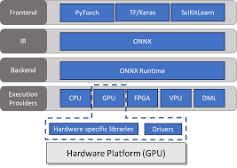

# Feasibility of perturbing `supercombo`

## ONNX Runtime (ORT)

[onnxruntime.ai](https://onnxruntime.ai/docs/get-started/with-python.html) is a post-hoc backend for accelerating, or using in a distributed manner, models from various frameworks using various hardware architectures developed by Microsoft. 
ORT can be used for inferencing with `PyTorch`, `Tensorflow/Keras`, `TFLite`, `scikit-learn` or training with `PyTorch`.
The basic setup for inferencing is:

1. **Get a model.** This can be trained from any framework that supports export/conversion to ONNX format. See the tutorials for some of the popular frameworks/libraries.
2. **Load and run the model with ONNX Runtime.** See the basic tutorials for running models in different languages.
3. **(Optional) Tune performance** using various runtime configurations or hardware accelerators. There are lots of options here - see How to: Tune Performance as a starting point.

Below is a high level look at the ORT framework:



However, `onnxruntime` uses gradients from the ML framework of the original model and then does the computation itself. 
This means that it's dependent on having the model architecture in another framework, e.g. pytorch, which is 90% of the work of converting ONNX to pytorch.
So, ORT is not much of a workaround.

### References on ONNX gradient operators 
* [onnxruntime.ai for inferencing](https://onnxruntime.ai/docs/build/inferencing.html)
* [onnxruntime.ai for training](https://onnxruntime.ai/docs/build/training.html)
* [Technical deep dive of ORT training](https://techcommunity.microsoft.com/t5/ai-machine-learning-blog/onnx-runtime-training-technical-deep-dive/ba-p/1398310)
* [open issue on ONNX gradient support](https://github.com/microsoft/onnxruntime/discussions/5892)
* [Fine-tuning an ONNX model](https://mxnet.apache.org/versions/1.9.0/api/python/docs/tutorials/packages/onnx/fine_tuning_gluon.html)
* [List of all ONNX operators and functions](https://github.com/onnx/onnx/blob/main/docs/Operators.md)
* [ONNX differentiable inputs](https://fossies.org/linux/onnx/docs/DefineDifferentiability.md)


## Converting the model to PyTorch using DNNF and DNNV
Since ONNX doesn't support gradient attachment (or, rather, it relies on a PyTorch frontend to do so), and PyTorch does, let's try converting the model to PyTorch.
[DNNF](https://github.com/dlshriver/dnnf) and [DNNV](https://github.com/dlshriver/dnnv) are tools for verifying and analyzing neural networks. 
DNNF builds off of DNNV and focuses on falsifying neural networks. 
To perform verification, these tools first need the networks in consistent formats.
The DNNV tool supports parsing the model into an operation graph, and the DNNF tool builds on DNNV in order to convert the model to PyTorch.

To convert the model to an operational graph, then to a PyTorch model, I've added the following code to `model-manipulator.py`:

```python
    from dnnv.nn import parse
    from dnnf.pytorch import convert
    op_graph = parse(args.modelpath)
    pytorch_model = convert(op_graph)
```

### Operators already defined by DNNV
Used by `dnnv.nn.parser`:
```python
operations.base.__all__     = ["Op", "Operation", "Input", "OutputSelect"]
operations.math.__all__     = ['Add', 'Atan', 'Div', 'Elu', 'Gemm', 'LeakyRelu', 'LogSoftmax', 'MatMul', 'Mul', 'Relu', 'Sigmoid', 'Sign', 'Softmax', 'Sub', 'Tanh']
operations.nn.__all__       = ['AveragePool', 'BatchNormalization', 'Conv', 'ConvTranspose', 'Dropout', 'GlobalAveragePool', 'MaxPool']
operations.patterns.__all__ = ["OperationPattern", "Or", "Parallel", "Sequential"]
operations.tensor.__all__   = ['Cast', 'Concat', 'Expand', 'Flatten', 'Gather', 'Identity', 'Pad', 'Reshape', 'Resize', 'Shape', 'Tile', 'Transpose', 'Unsqueeze']
```

One of the operators in the supercombo model, `Split`, is not included in the DNNF/DNNV supported operators.
It's a tensor operator that splits the tensor into chunks of variable number and size.
The analogous pytorch operator is [here](https://pytorch.org/docs/stable/generated/torch.split.html).
I've added the code to allow the DNNV parser to this operator into `dnnv/nn/operations/tensor.py`:

```python
class Split(Operation):
    def __init__(self, x, axis, split, *, name: Optional[str] = None):
        super().__init__(name=name)
        self.x = x
        self.axis = axis

    @classmethod
    def from_onnx(cls, onnx_node, *inputs):
        attributes = {a.name: as_numpy(a) for a in onnx_node.attribute}
        axis = attributes.get("axis")
        split = attributes.get("split")
        split = np.array(split)
        return cls(*inputs, axis=axis, split=split, name=onnx_node.name)
```

To handle the conversion to pytorch, I need to add a new `Operator` to DNNF, 
and extend DNNF to handle operators with multiple outputs, as well as variable outputs.
This should be manageable all within the new `Split` operator, as long as I keep proper track of how the visitor visits the output nodes.
Also, DNNF happens to visit nodes from the bottom up, meaning it visits outputs before inputs.
Not necessarily a complication, but something to keep in mind.

## Install DNNF and DNNV from local

First, upgrade pip so that it is the most recent version that supports .toml setup files:
```bash
.\python.exe -m pip install --upgrade pip
```

I have used `pip-22.0.4`. Note that I also call the pip module through my virtualenv python to avoid installing to the wrong location.


```python
.\python.exe -m pip --default-timeout=300 install -e </path/to/dnnf>
.\python.exe -m pip install -e H:\GitHub\dnnv[all]
```

## Run DNNF on a property

```python
. .venv/bin/activate
dnnf testing-openpilot/model-manipulation/properties/supercombo-property01.py --network N testing-openpilot/models/supercombo.onnx --n_starts 100 --save-violation counterexample.npy
```

## Examples for falsification properties

See [DNNV benchmark](https://github.com/dlshriver/dnnv-benchmarks/tree/main/benchmarks)
 for example falsification properties.


## Path Visualization

[Path visualization for an old version of the supercombo model](https://littlemountainman.github.io/2020/05/12/openpilot/)
[see here](https://github.com/littlemountainman/modeld/blob/master/lane_visulaizer_dynamic.py)

